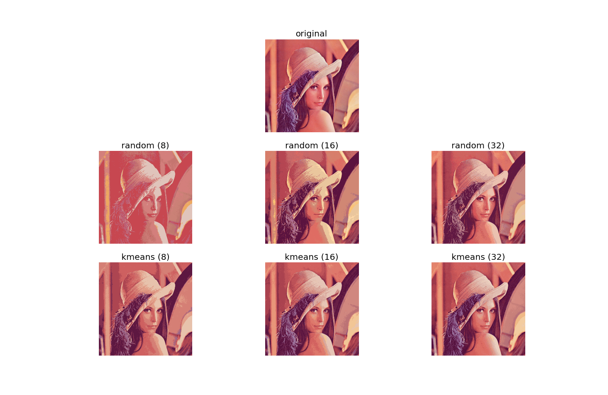

# Image Quantizer
## Color Image Quantization

Perform color quantization by selecting the palette randomly or using K-means.

### Environment

Setup the environment using conda:

    conda env create -f environment.yml

### Sample Usage

Here's a sample usage that displays the output of the color quantization
performed on the same image using random selection and K-means:

    from image_quantizer import quantizer

    q = quantizer.ImageQuantizer()

    qimages = q.quantize_multi([
        {'n_colors': 8, 'method': 'random'},
        {'n_colors': 16, 'method': 'random'},
        {'n_colors': 32, 'method': 'random'},
        {'n_colors': 8, 'method': 'kmeans'},
        {'n_colors': 16, 'method': 'kmeans'},
        {'n_colors': 32, 'method': 'kmeans'}
    ], image_filename='tests/fixtures/Lenna.png')

    quantizer.compare(*qimages)

The output will be something as follows:

## License
